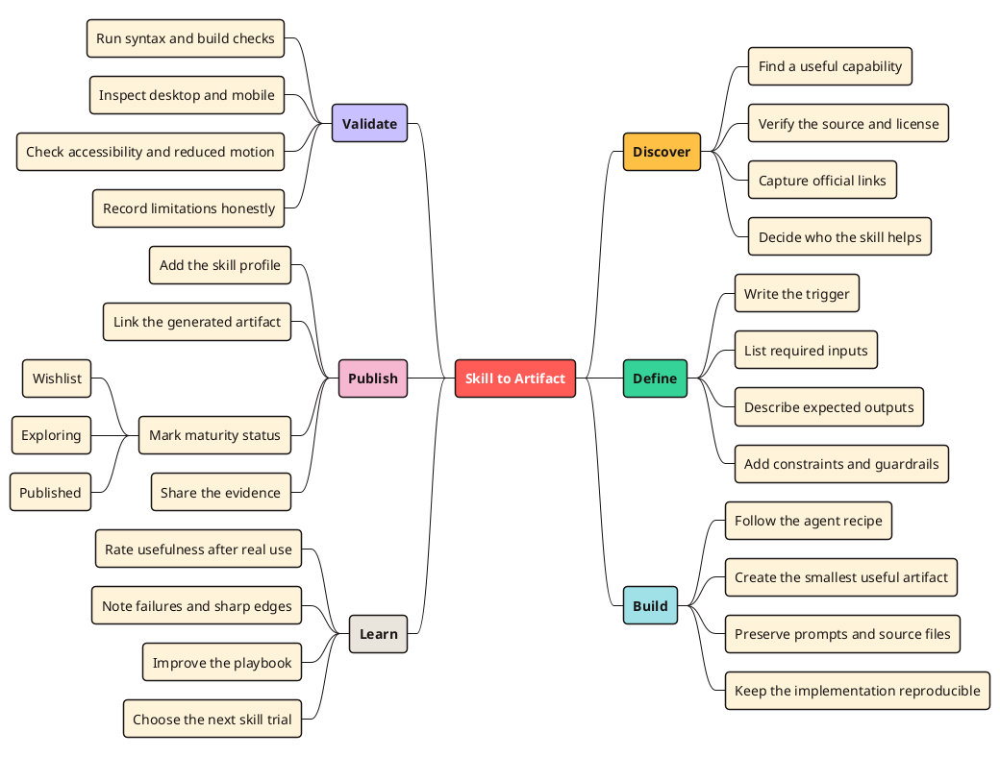

# Skill-to-Artifact System Map

```plantuml
@startmindmap
<style>
mindmapDiagram {
  node {
    BackgroundColor #FFF3D9
    FontColor #171313
    LineColor #171313
    RoundCorner 8
  }
  :depth(0) {
    BackgroundColor #FF5B57
    FontColor #FFFFFF
    FontStyle bold
  }
  :depth(1) {
    FontStyle bold
  }
  arrow {
    LineColor #171313
  }
}
</style>
* Skill to Artifact
**[#FFC145] Discover
*** Find a useful capability
*** Verify the source and license
*** Capture official links
*** Decide who the skill helps
**[#36D399] Define
*** Write the trigger
*** List required inputs
*** Describe expected outputs
*** Add constraints and guardrails
**[#9FE1E7] Build
*** Follow the agent recipe
*** Create the smallest useful artifact
*** Preserve prompts and source files
*** Keep the implementation reproducible

left side
**[#C9C0FF] Validate
*** Run syntax and build checks
*** Inspect desktop and mobile
*** Check accessibility and reduced motion
*** Record limitations honestly
**[#F6B7D1] Publish
*** Add the skill profile
*** Link the generated artifact
*** Mark maturity status
**** Wishlist
**** Exploring
**** Published
*** Share the evidence
**[#EAE5DC] Learn
*** Rate usefulness after real use
*** Note failures and sharp edges
*** Improve the playbook
*** Choose the next skill trial
@endmindmap
```

The browser artifact mirrors these six branches while keeping this source easy to edit and render in a PlantUML-aware Markdown viewer.
